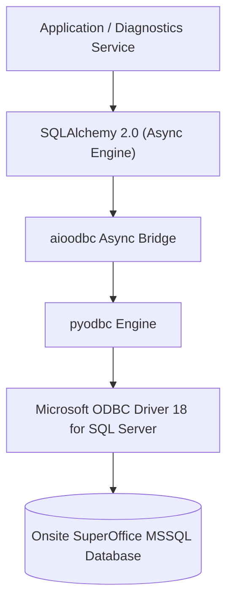
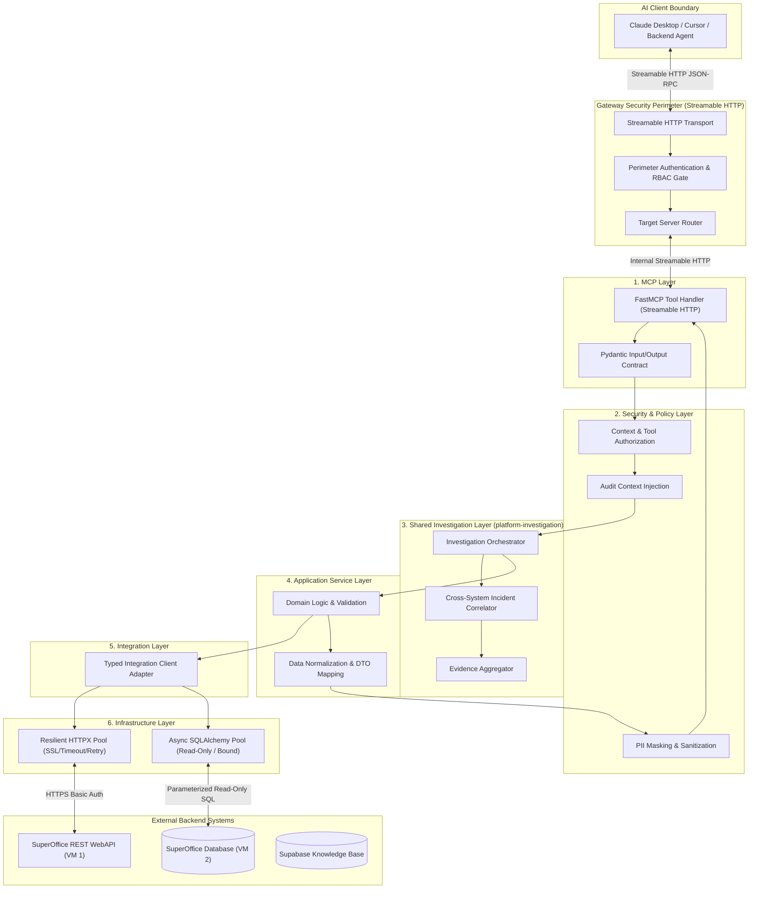

# Python Foundation Architecture Design
**Platform:** SuperOffice AI Support MCP Platform  
**Phase:** 1B — Foundation Implementation  
**Status:** Implementation Complete (Implementation matches approved architecture.)  
**Classification:** Internal Technical Architecture  

---

## 1. Executive Summary & Core Architectural Tenets

The **SuperOffice AI Support MCP Platform** is an enterprise-grade AI-assisted diagnostic, support, and investigation system. It bridges LLM reasoning engines (Claude Desktop, Cursor, Antigravity, and backend AI agents) with Onsite SuperOffice CRM, MS SQL Database clusters, Supabase knowledge stores, and infrastructure diagnostics.

### Core Architecture Tenets:
1. **Mandatory Streamable HTTP Transport (ADR 007)**: In strict adherence to ADR 007, Streamable HTTP is the mandatory protocol transport for all MCP interactions. All stdio and legacy SSE ambiguities are eliminated.
2. **Zero-Trust Isolation**: The Gateway is the hardened perimeter. Every MCP server operates behind authorization gates, enforcing least privilege and PII redaction.
3. **Layered Separation of Concerns**: MCP Layer $\rightarrow$ Security Layer $\rightarrow$ Investigation & Service Layer $\rightarrow$ Integration Layer $\rightarrow$ Infrastructure Layer. MCP tools never directly execute raw SQL or unvetted external APIs.
4. **Fail-Fast Typed Configuration**: All configuration is statically and dynamically validated at startup using Pydantic Settings; missing mandatory settings halt initialization immediately.
5. **Data Privacy & Redaction by Default**: Customer data, ticket bodies, and database records pass through security sanitization and PII masking before reaching the AI context.
6. **No Production Access in Test/Design**: Strict interface contracts and mock layers ensure zero dependency on live environments during development and automated testing.

---

## 2. Technology Selection & Recommended Version Matrix

| Category | Technology | Recommended Version | Architectural Justification |
| :--- | :--- | :--- | :--- |
| **Runtime Language** | **Python** | `3.12.x` (LTS target) | Optimal balance of performance, modern type hinting (`type` statements, PEP 695), enhanced `asyncio`, and universal ecosystem support for MCP & data libraries. |
| **MCP Protocol SDK** | **`mcp`** (Official SDK) | `~=1.3.0` | Official Model Context Protocol Python SDK (`modelcontextprotocol/python-sdk`) with native Streamable HTTP server support (`mcp.server.fastmcp.FastMCP`). |
| **Data Validation** | **Pydantic v2** | `~=2.10.0` | Rust-backed high-throughput validation, native JSON schema emission for MCP tool contracts, robust serialization, and field-level metadata. |
| **Typed Settings** | **Pydantic Settings** | `~=2.7.0` | Environment variable parsing, `.env` file ingestion for development, nested configurations, and fail-fast validation. |
| **Async HTTP Client** | **HTTPX** | `~=0.28.0` | Enterprise-grade async HTTP/1.1 and HTTP/2 client with connection pooling, custom transport hooks, timeout guards, and SSL verification controls. |
| **Async MSSQL Layer** | **SQLAlchemy 2.0 Async + `aioodbc`** | `sqlalchemy[asyncio]~=2.0.38`<br/>`aioodbc~=0.5.0` | Enterprise async connection pooling, statement timeouts, parameterized query enforcement, and native binding over Microsoft ODBC Driver 18. |
| **ODBC Driver** | **Microsoft ODBC Driver 18** | `18.x` (Host/System) | Microsoft's official high-performance driver supporting TLS 1.3 encryption, NTLM/Kerberos/SQL auth, and robust connection health verification. |
| **Knowledge Store** | **`supabase-py` / `postgrest`** | `~=2.11.0` | Managed async vector search and documentation indexing for RAG within the Knowledge MCP boundary. |
| **Structured Logging** | **`structlog`** | `~=24.4.0` | High-performance contextual structured JSON logging to `stderr`, correlation ID injection, and automatic credential/PII scrubbing processors. |
| **Test Framework** | **`pytest` + `pytest-asyncio`** | `pytest~=8.3.0`<br/>`pytest-asyncio~=0.25.0` | Async testing harness, fixture lifecycle isolation, parametrized contract tests, and high-coverage mocking utilities. |
| **Code Quality & Linter** | **`ruff`** | `~=0.9.0` | Ultra-fast linter and formatter replacing Flake8, Black, isort, and pyupgrade in a single tool. |
| **Static Type Checker** | **`mypy`** | `~=1.14.0` | Strict static type validation (`--strict`, `disallow_untyped_defs = true`) ensuring 100% type annotations across domain and tool contracts. |
| **Package / Workspace** | **`uv`** | `>=0.5.0` | Modern, lightning-fast Python package and workspace manager enforcing locked dependency trees (`uv.lock`) and isolated multi-package workspaces. |

---

## 3. MSSQL Access Strategy Evaluation & Recommendation

A thorough architectural evaluation was conducted across the four primary candidates for database access:



### Comparative Analysis:

| Metric / Requirement | `pyodbc` (Direct) | `aioodbc` (Direct) | **SQLAlchemy 2.0 Async (`aioodbc`)** | Microsoft ODBC Driver 18 |
| :--- | :--- | :--- | :--- | :--- |
| **Async Event Loop Safety** | ❌ **No**. Blocks Python GIL/event loop unless manually wrapped in `to_thread`. | ⚠️ **Partial**. Async connection wrapper around pyodbc via thread pool executor. | ✅ **Yes**. Full native async interface via `AsyncEngine` and `AsyncSession`. | *N/A (C-level driver)* |
| **Connection Pooling** | ❌ Primitive / Single connection management. | ⚠️ Basic connection pool; limited health check & reap logic. | ✅ **Enterprise-Grade**. `AsyncAdaptedQueuePool` with health ping, recycling, max overflow. | ✅ Driver-level connection pooling support. |
| **Statement Timeout Enforcement** | ⚠️ Driver-dependent `timeout` kwarg. | ⚠️ Per-query timeout requires manual cancellation handling. | ✅ **Robust**. Driver-level query timeout and execution options (`execution_options(timeout=5.0)`) enforced automatically. | ✅ Supports `QueryTimeout` in connection string. |
| **SQL Injection Prevention** | ⚠️ Relies entirely on developer passing tuples to `.execute()`. | ⚠️ Relies on manual parameter binding. | ✅ **Structural Compilation**. `text()` with bound parameters or Core AST guarantees parameterization. | ✅ Parameterized protocol support at TDS layer. |
| **Testing & Mocking** | ❌ Difficult to mock without live ODBC driver installed. | ⚠️ Requires custom async context manager mocks. | ✅ **Superior**. Can bind to async in-memory SQLite for offline unit/integration test suites. | *N/A (Host binary)* |

### Final Recommendation:
- **Underlying Driver**: Standardize on **Microsoft ODBC Driver 18 for SQL Server** across host and container runtimes.
- **Python Access Layer**: Standardize on **SQLAlchemy 2.0 Async with `aioodbc` dialect** (`mssql+aioodbc://`).
- **Safety Constraints**:
  1. Transaction isolation enforcement: **`SNAPSHOT`** isolation (operational prerequisite: DBA confirms `ALLOW_SNAPSHOT_ISOLATION=ON` on target database; no DDL executed by application).
  2. Hard statement query timeouts strictly capped at **`5.0s`**.
  3. Result sets strictly bounded using `SELECT TOP (50)` / parameterized limit (`effective_limit = min(requested, 50)`).
  4. Connection pool configured with `pool_pre_ping=True`, `pool_size=10`, `max_overflow=5`, and `pool_recycle=1800`.

---

## 4. Monorepo Directory Architecture

The platform uses a **`uv` Workspace Monorepo** where the Gateway, individual MCP servers, and shared libraries are cleanly segregated into modular Python packages with explicit dependency boundaries.

```text
superoffice-ai-platform/
├── docs/
│   ├── adr/
│   │   ├── 001-gateway-architecture.md
│   │   ├── 002-data-classification.md
│   │   ├── 007-transport-protocol.md          # Mandatory Streamable HTTP
│   │   └── 011-python-project-architecture.md # Updated ADR
│   ├── python-architecture.md                 # This specification
│   ├── security-model.md
│   └── server-responsibilities.md
├── src/
│   ├── gateway/                               # MCP Gateway (Perimeter Security & Router)
│   │   ├── pyproject.toml
│   │   └── src/
│   │       └── platform_gateway/
│   │           ├── __init__.py
│   │           ├── main.py                    # Gateway Streamable HTTP Entrypoint
│   │           ├── router.py                  # Downstream MCP routing & capability mapping
│   │           ├── security/                  # Perimeter auth, token inspection, RBAC gate
│   │           └── middleware/                # Correlation ID, rate limiting, sanitization
│   │
│   ├── servers/                               # Isolated MCP Server Runtimes
│   │   ├── superoffice/                       # SuperOffice Core MCP Server
│   │   │   ├── pyproject.toml
│   │   │   └── src/
│   │   │       └── so_mcp/
│   │   │           ├── __init__.py
│   │   │           ├── server.py              # FastMCP Streamable HTTP Server definition
│   │   │           ├── tools/                 # Contact, Person, Appointment, Ticket tools
│   │   │           ├── resources/             # SuperOffice metadata & schema resources
│   │   │           ├── services/              # CRM Business logic & entity mappings
│   │   │           └── adapters/              # SuperOffice REST WebAPI client adapter
│   │   │
│   │   ├── diagnostics/                       # Database & Log Diagnostics MCP Server
│   │   │   ├── pyproject.toml
│   │   │   └── src/
│   │   │       └── diag_mcp/
│   │   │           ├── __init__.py
│   │   │           ├── server.py              # FastMCP Streamable HTTP Server definition
│   │   │           ├── tools/                 # Log inspection, query runners, health tools
│   │   │           ├── services/              # Query planner, result bounding, log parser
│   │   │           └── adapters/              # Read-only Async SQLAlchemy MSSQL client
│   │   │
│   │   ├── knowledge/                         # Knowledge & Runbook MCP Server (Supabase/RAG)
│   │   │   ├── pyproject.toml
│   │   │   └── src/
│   │   │       └── kb_mcp/
│   │   │           ├── __init__.py
│   │   │           ├── server.py              # FastMCP Streamable HTTP Server definition
│   │   │           ├── tools/                 # KB search, runbook retriever, doc tools
│   │   │           ├── services/              # Semantic retrieval & relevance ranker
│   │   │           └── adapters/              # Supabase vector client adapter
│   │   │
│   │   └── infrastructure/                    # Infrastructure & Host Diagnostics MCP Server
│   │       ├── pyproject.toml
│   │       └── src/
│   │           └── infra_mcp/
│   │               ├── __init__.py
│   │               ├── server.py              # FastMCP Streamable HTTP Server definition
│   │               ├── tools/                 # IIS status, disk/memory, service health
│   │               ├── services/              # Host metrics aggregator
│   │               └── adapters/              # WMI / WinRM / System performance client
│   │
│   └── shared/                                # Shared Enterprise Domain Libraries
│       ├── platform-investigation/            # Evidence Aggregation & Investigation Orchestration
│       │   ├── pyproject.toml
│       │   └── src/
│       │       └── platform_investigation/
│       │           ├── __init__.py
│       │           ├── aggregator.py          # Multi-source Evidence Aggregator
│       │           ├── orchestrator.py        # Investigation Workflow Engine
│       │           ├── correlation.py         # Cross-system Incident Correlator
│       │           └── models.py              # Investigation & Diagnostic State Models
│       │
│       ├── platform-core/                     # Core primitives, base classes, common types
│       │   ├── pyproject.toml
│       │   └── src/
│       │       └── platform_core/
│       │           ├── __init__.py
│       │           ├── constants.py
│       │           ├── errors.py              # Hierarchical platform exceptions
│       │           └── models.py              # Base Pydantic domain models
│       │
│       ├── platform-config/                   # Typed configuration architecture
│       │   ├── pyproject.toml
│       │   └── src/
│       │       └── platform_config/
│       │           ├── __init__.py
│       │           ├── base.py                # Pydantic BaseSettings & validators
│       │           └── environments/          # Local, Staging, Prod setting models
│       │
│       ├── platform-security/                 # Auth, RBAC, PII Redaction, Sanitization
│       │   ├── pyproject.toml
│       │   └── src/
│       │       └── platform_security/
│       │           ├── __init__.py
│       │           ├── auth.py                # Token & Principal models
│       │           ├── rbac.py                # Role & Tool permission policy matrix
│       │           ├── pii.py                 # Regex & contextual PII scrubbing engines
│       │           ├── attachments.py         # Attachment security & authorization gate
│       │           └── sanitizer.py           # Response output scrubber
│       │
│       ├── platform-observability/            # Structured logging & telemetry
│       │   ├── pyproject.toml
│       │   └── src/
│       │       └── platform_observability/
│       │           ├── __init__.py
│       │           ├── logging.py             # Structlog configuration & processors
│       │           ├── correlation.py         # ContextVar request & trace ID propagation
│       │           ├── audit.py               # Structured audit trail emitter
│       │           └── metrics.py             # Metric counter & latency collector
│       │
│       └── platform-http/                     # Resilient HTTP Client with pooling & auth
│           ├── pyproject.toml
│           └── src/
│               └── platform_http/
│                   ├── __init__.py
│                   ├── client.py              # Async HTTP client wrapper
│                   ├── middleware.py          # Retries, jitter backoff, SSL handling
│                   └── errors.py              # HTTP specific error transformations
│
├── tests/                                     # Enterprise Monorepo Test Suites
│   ├── unit/                                  # Fast unit tests (zero I/O)
│   ├── integration/                           # Integration tests with containerized mocks
│   ├── contract/                              # MCP protocol & tool contract tests
│   ├── security/                              # RBAC policy, PII leak & authorization tests
│   └── fixtures/                              # Synthetic test datasets (No real PII/creds)
│
├── .env.example                               # Sanitized environment template
├── .gitignore
├── pyproject.toml                             # Root workspace manifest (PEP 621 / uv)
├── ruff.toml                                  # Unified linter & formatter rules
└── uv.lock                                    # Deterministic dependency lockfile
```

---

## 5. Architectural Layering & Data Flow

To maintain absolute decoupling and prevent AI reasoning leakage into backend stores, each server conforms to strict architectural layering:



---

## 6. Shared Investigation Package (`platform-investigation`)

The `platform-investigation` package acts as the enterprise diagnostic intelligence backbone across all servers:

### Core Responsibilities:
1. **Evidence Aggregation (`aggregator.py`)**:
   - Collects, timestamps, and contextualizes evidence items across SuperOffice tickets, database log records (`y_logticket`, `y_logactivity`), knowledge runbooks, and host metrics.
   - Assigns confidence ratings and structural metadata to each evidence artifact.
2. **Investigation Orchestration (`orchestrator.py`)**:
   - Manages diagnostic state machines (e.g., *Symptom Identification* $\rightarrow$ *Audit Log Analysis* $\rightarrow$ *Root Cause Correlation* $\rightarrow$ *Runbook Resolution*).
   - Enforces execution step limits and prevents runaway tool call loops.
3. **Incident Correlation (`correlation.py`)**:
   - Links SuperOffice Ticket IDs, CRM Contact IDs, IIS Request IDs, and database error log timestamps into a unified incident timeline.
4. **Diagnostic Models (`models.py`)**:
   - Defines standard Pydantic models for `EvidenceItem`, `DiagnosticHypothesis`, `InvestigationPlan`, and `IncidentTimeline`.

---

## 7. Transport Architecture (Streamable HTTP Mandatory)

Per **ADR 007**, all MCP communication across the platform strictly utilizes **Streamable HTTP**:
- **Protocol**: HTTP/1.1 and HTTP/2 POST/SSE streaming compliant with the official Model Context Protocol Streamable HTTP specification.
- **Gateway Role**: Terminates client Streamable HTTP connections, validates session tokens, enforces rate limits, and streams downstream tool execution events back to the client.
- **Server Role**: Each backend MCP server binds to a dedicated Streamable HTTP listener on an internal network socket or loopback port, receiving routed tool calls from the Gateway.

---

## 8. Configuration Architecture

Configuration adheres to the **Twelve-Factor App** principles, implemented via `pydantic-settings`.

### Design Rules:
- **Strict Typing**: All configuration parameters are strongly typed with validation constraints (e.g., `PositiveInt`, `HttpUrl`, `SecretStr`).
- **Secret Masking**: All sensitive tokens and passwords use `pydantic.SecretStr` to prevent accidental logging or terminal display.
- **Fail-Fast Boot Validation**: Missing mandatory variables cause the server to fail immediately upon execution with a clear diagnostic message, rather than failing during request processing.
- **Zero Secrets in Code/Git**: Credentials are read strictly from OS environment variables. `.env` files are used exclusively in local developer workspaces and are `.gitignore`d.

---

## 9. Security & Authorization Architecture

### 1. Gateway Perimeter Defense
- Acts as the central authentication boundary for incoming client sessions.
- Injects validated `SecurityContext` attributes (`user_id`, `role`, `correlation_id`, `production_write`, `attachment_access`) as trusted internal transport headers into every forwarded request.

### 2. Role-Based Access Control (RBAC) Matrix

| Caller Role | SuperOffice MCP | Diagnostics MCP | Knowledge MCP | Infrastructure MCP | Attachment Content |
| :--- | :---: | :---: | :---: | :---: | :---: |
| **Support Agent L1** | Read (Tickets, Contacts) | Read (App Logs only) | Read All | Health Status only | **Denied** |
| **Support Engineer L2** | Read/Write (Tickets) | Read (Database & Logs) | Read/Write | Metrics & Health | **Metadata Only** |
| **Platform Admin L3** | Full Access | Full Access | Full Access | Full Access | **Authorized via Gate** |

### 3. PII Filtering & Output Sanitization
- All string outputs returned to the AI context pass through the **Sanitization Pipeline**.
- Patterns for credit cards, national ID numbers (CPR/SSN), cleartext passwords, and bearer tokens are automatically masked:
  - Phone numbers formatted: `+47 ••• •• 123`
  - Email addresses masked: `a•••@example.com`
  - Secrets / API keys replaced with `[REDACTED_SECRET]`

### 4. Attachment Security Gate
- Attachment content download is **disabled by default**.
- Tool contracts only return attachment metadata (Filename, Size, MIME type, MD5 hash).
- Retrieval of attachment content requires an explicit, time-bounded, audit-logged authorization token issued through the Security Layer.

---

## 10. Standardized MCP Tool Pipeline

Every tool adheres to the 6-stage lifecycle:
$$\text{Input Validation} \longrightarrow \text{Authorization Check} \longrightarrow \text{Investigation/Domain Logic} \longrightarrow \text{Adapter Call} \longrightarrow \text{PII Redaction} \longrightarrow \text{Streamable HTTP Response}$$

---

## 11. Error Handling & Information Leakage Prevention

To prevent exposing internal infrastructure topography, credentials, or stack traces to LLM clients, the platform enforces a **Sanitized Error Transformation Hierarchy**:

```text
[Low-Level Drivers: SocketError, pyodbc.ProgrammingError, httpx.ConnectTimeout]
                                ↓
        [Platform Adapter: IntegrationConnectionError, ExternalAPIError]
                                ↓
        [Domain Service: ResourceNotFoundError, QueryExecutionError]
                                ↓
        [Security Layer: AuthorizationError, ValidationError]
                                ↓
        [MCP Layer: Sanitized Error Response (isError: True)]
                                ↓
                    [AI Client Context]
```

---

## 12. Observability Architecture

1. **Structured JSON Logging (`structlog`)**: Emits structured JSON logs to `stderr` (preserving protocol streams).
2. **Correlation IDs**: ContextVar-propagated `correlation_id` attached to all logs, traces, and downstream HTTP calls.
3. **Zero-PII Logging**: Passwords, authorization tokens, full ticket bodies, and raw customer PII are strictly excluded from logging processors.

---

## 13. Testing Architecture & Mocking Strategy

The repository mandates an offline-first test harness:
- **SuperOffice WebAPI**: Mocked via `respx` / `httpx.MockTransport` using verified JSON fixtures.
- **MSSQL Database**: Mocked via async SQLite engines with matching SQLAlchemy schema definitions.
- **Supabase**: Mocked via protocol-level stubbing of the postgrest client.
- **Security & RBAC**: Parametrized role-based test fixtures (L1, L2, L3).

---

## 14. Developer Workflow

```bash
# Setup uv workspace
uv venv
source .venv/bin/activate  # or .venv\Scripts\activate on Windows
uv sync --all-packages

# Formatting & Linting
uv run ruff check . --fix
uv run ruff format .

# Strict Type Checking
uv run mypy src tests

# Test Execution
uv run pytest --cov=src --cov-report=term-missing
```

---

## 15. Containerization & Deployment Boundaries

```text
┌─────────────────────────────────────────────────────────────┐
│                      Deployment Pods                        │
├─────────────────────────┬───────────────────────────────────┤
│ Pod 1: MCP Gateway      │ Container: gateway:latest         │
├─────────────────────────┼───────────────────────────────────┤
│ Pod 2: SuperOffice MCP  │ Container: so-mcp:latest          │
├─────────────────────────┼───────────────────────────────────┤
│ Pod 3: Diagnostics MCP  │ Container: diag-mcp:latest        │
├─────────────────────────┼───────────────────────────────────┤
│ Pod 4: Knowledge MCP    │ Container: kb-mcp:latest          │
├─────────────────────────┼───────────────────────────────────┤
│ Pod 5: Infrastructure   │ Container: infra-mcp:latest       │
└─────────────────────────┴───────────────────────────────────┘
```
